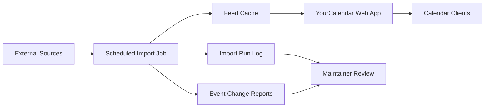

# Hosting and Scheduler Architecture

## Ziel

YourCalendar soll abonnierbare ICS-Feeds stabil ausliefern, Importjobs wiederholbar ausführen und Fehler sichtbar machen, ohne Secrets oder Laufzeitdaten ins Repository zu schreiben.

Diese Architektur ist ein MVP-Vorschlag. Konkrete Hosting-Anbieter, Preise und SLAs sind hier bewusst nicht final behauptet.

## Architektur

## Komponenten

| Komponente | MVP-Entscheidung | Zweck |
| --- | --- | --- |
| Website / Feed Server | Python `web_app.py` hinter HTTPS | Liefert UI, API und stabile `.ics` URLs aus |
| Import Scheduler | GitHub Actions oder Hosting-Cron | Führt `python3 import_jobs.py` wiederholt aus |
| Feed Cache | `output/feeds/` | Hält den letzten erfolgreichen Feed je Kalender |
| Run Log | `output/import-runs.json` | Protokolliert Erfolg, Warnungen, Fehler und Event-Anzahl |
| Change Reports | `output/event-changes/` | Dokumentiert neue, geänderte und fehlende Events |
| Event Snapshots | `output/event-snapshots/` | Vergleichsstand für spätere Imports |
| Secrets | Plattform-Secrets, nie Git | API Keys, Tokens und Deploy-Zugang |

## Umgebungen

| Umgebung | Zweck | Quelle |
| --- | --- | --- |
| Local | Entwicklung und manuelle Tests | Lokale Dateien, Sample-Feeds |
| Preview | PR-Checks, Smoke Tests, Review | Temporäre CI-Läufe ohne produktive Secrets |
| Stage | Vorproduktion für Import- und Feed-Verhalten | Echte Scheduler-Konfiguration mit begrenzten Quellen |
| Production | Öffentliche Website und stabile Feed-URLs | Geplante Jobs, HTTPS, Monitoring |

## Scheduler-Start

Der erste betreibbare Scheduler kann als GitHub Actions Workflow laufen:

- `workflow_dispatch` für manuelle Läufe
- `schedule` für regelmäßige Aktualisierung
- Import über `python3 -B import_jobs.py`
- Feed-Cache und Logs als Artefakte
- Kein Commit von generierten Feeds zurück ins Repository

Wenn später ein Hosting-Anbieter Cronjobs, persistenten Speicher und Deploy Hooks bereitstellt, kann derselbe Importbefehl unverändert dort ausgeführt werden.

## Persistenz

Der aktuelle MVP schreibt Laufzeitdaten in `output/`. Das ist bewusst als erster Schritt gewählt.

Für Production braucht es danach eine persistente Ablage außerhalb des Git-Repositories:

- Objekt-/Dateispeicher für `.ics` Feeds
- kleine Datenbank oder JSON-kompatibler Store für Run Logs
- optional separater Speicher für Event Snapshots und Change Reports

## Secrets

Secrets dürfen nicht im Repository liegen.

Erlaubt:

- GitHub Actions Secrets
- Hosting-Provider Environment Variables
- lokale `.env` Dateien, die von `.gitignore` ausgeschlossen sind

Nicht erlaubt:

- API Keys in `.py`, `.js`, `.json`, `.md`
- generierte `.ics` Feeds mit sensiblen Metadaten im Git-Verlauf
- persönliche Tokens in Workflow-Dateien

## Betriebsregeln

- Fehler in einer Quelle dürfen bestehende Feeds nicht löschen.
- Leere Ergebnisse werden als `warning` behandelt, nicht blind als Erfolg.
- Der letzte erfolgreiche Feed bleibt abonnierbar.
- Importläufe müssen nachvollziehbar sein: Zeit, Status, Event-Anzahl, Fehlertext.
- Source- und Event-Change-Reports sind Maintainer-Werkzeuge und nicht automatisch öffentliche Nutzertexte.

## Offene Entscheidungen

- Finaler Hosting-Anbieter für Website und Feed-Auslieferung.
- Persistenter Speicher für Feed Cache, Run Logs und Snapshots.
- Produktionsintervall pro Quelle.
- Retention-Regel für alte Run Logs und Change Reports.
- Entscheidung, ob Feeds direkt vom Webserver oder aus einem CDN/Object Storage ausgeliefert werden.
