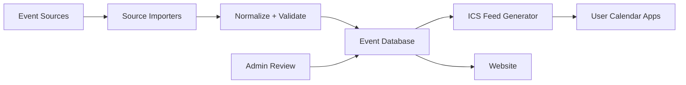

# YourCalendar Project Backlog

Stand: 2026-05-18

## Zielbild

YourCalendar soll private Kalender besser organisieren, indem Nutzer thematische Kalender abonnieren oder mit ihren bestehenden Kalendern verbinden koennen. Quellen koennen Sport, Politik, Stadtveranstaltungen, Festivals, TV/Streaming, Ferien und Partner-Events sein.

Das Kernprodukt ist zuerst eine Website mit abonnierbaren Kalendern. Eine App kann spaeter folgen, wenn Nutzung, Sync-Probleme oder Personalisierung das rechtfertigen.

## Annahmen

- MVP-Ziel ist nicht, alle Kalender direkt in Google/Outlook zu schreiben, sondern zunaechst stabile abonnierbare Kalenderfeeds per iCalendar/ICS bereitzustellen.
- Direkte Google- und Outlook-Integrationen kommen als zweite Stufe, weil OAuth, Datenschutz, Token-Handling und App-Verification mehr Aufwand erzeugen.
- Viele attraktive Event-Datenquellen haben keine freie oder stabile offizielle API. Deshalb braucht jede Quelle einen eigenen Legal-/API-Check.
- Partner koennen langfristig offizielle Daten liefern, aber fuer den MVP sollten wir nicht davon abhaengig sein.

## Issue Types

| Type | Zweck | Beispiele |
| --- | --- | --- |
| Dev | Produkt- und Feature-Entwicklung | Kalenderfeed, UI, Source-Importer, Event-Deduplizierung |
| DevOps | Architektur, Infrastruktur, Deployment, Sicherheit | Hosting, Jobs, Monitoring, Secrets, CI/CD |
| Orga | Recherche, Partnerschaften, Produktstrategie, Rechtliches | API-Checks, Partneransprache, Preismodell, DSGVO-Klaerung |
| Ops | Regelbetrieb, Datenpflege, Support, Qualitaetskontrolle | Import-Monitoring, manuelle Korrekturen, Incident Handling |

## Datenquellen Ersteinschaetzung

| Quelle | Status | Nutzen | Risiken / offene Punkte | Naechster Schritt | Issue Type |
| --- | --- | --- | --- | --- | --- |
| Google Calendar API | Offizielle API vorhanden | Direkte Kalenderintegration, spaeter Sync in Nutzerkalender | OAuth, Google Cloud Setup, App Verification, Datenschutz | MVP erst ICS, danach Google OAuth Spike | Dev |
| Microsoft Outlook / Microsoft 365 | Offizielle Microsoft Graph Calendar API vorhanden | Outlook/Office-Integration | OAuth, Tenant-/Consumer-Unterschiede, Permissions | Microsoft Graph Spike planen | Dev |
| iCalendar / ICS | Offener Standard | Einfach abonnierbar in Apple, Google, Outlook und vielen Apps | Update-Verhalten je Client unterschiedlich | Als MVP-Ausgabeformat festlegen | Dev |
| CalDAV | Offener Standard | Breitere Kalenderkompatibilitaet | Aufwendiger als statische ICS-Feeds | Spaeter pruefen, nicht MVP-kritisch | DevOps |
| Bundestag / DIP | Offizielle maschinenlesbare Schnittstelle vorhanden | Politik-/Gesetzgebungs-Kalender | Eignet sich eher fuer Vorgangs-/Dokumentdaten; Terminqualitaet pruefen | DIP API Proof-of-Concept | Dev |
| Bundesliga / Fussball | Drittanbieter-APIs vorhanden; DFB/Kicker offiziell unklar | Hoher Nutzerwert | Lizenzen, Datenqualitaet, Live-Aenderungen, Kosten | Anbieter vergleichen: football-data.org, TheSportsDB, ggf. SportMonks/API-Football | Orga |
| UFC | Offizielle Website mit Schedule sichtbar; stabile oeffentliche API unklar | Kampfsport-Kalender | Datenrechte, Scraping-Risiko, Zeitzonen | Offizielle Partner-/Media-Moeglichkeiten pruefen | Orga |
| Oktagon MMA | Unklar | DACH-relevanter Kampfsport | Offizielle API unbekannt | Kontakt/Partneransprache und Website-Struktur pruefen | Orga |
| Festivals / Veranstaltungen | Ticketmaster, Eventbrite, PredictHQ u.a. APIs vorhanden | Breite Event-Abdeckung | Kosten, Region-Coverage, Weitergaberechte | 2-3 Anbieter fuer Deutschland/EU evaluieren | Orga |
| Schulferien / Feiertage | Mehrere oeffentliche Datenquellen moeglich | Einfacher Evergreen-Content | Lizenz und Aktualitaet je Quelle pruefen | Offizielle/open-data Quelle je Land identifizieren | Orga |

## MVP Scope

1. Oeffentliche Website mit Kategorien und Kalenderlisten.
2. Pro Kalender ein abonnierbarer ICS-Link.
3. Admin-/Maintainer-Workflow zum Anlegen und Pruefen von Quellen.
4. Automatische Jobs, die Events importieren, normalisieren und Feeds aktualisieren.
5. Transparente Quellen- und Partnerhinweise pro Kalender.

Nicht im MVP:

- Mobile App.
- Bidirektionaler Sync.
- Nutzerkonten, wenn nicht zwingend noetig.
- Bezahlmodell.
- Live-Ergebnisse oder kurzfristige Push-Benachrichtigungen.

## Architektur Vorschlag

### Kernmodule

- Source Adapter: pro Quelle ein klar abgegrenzter Importer.
- Event Normalizer: ein internes Eventmodell fuer Titel, Start, Ende, Ort, Quelle, Kategorie, URL, Status.
- Deduplication: verhindert doppelte Events aus mehreren Quellen.
- Feed Generator: erzeugt RFC-5545-kompatible ICS-Feeds.
- Website: zeigt Kalender, Quellenstatus, Partner und Abo-Links.
- Operations Dashboard: zeigt Importfehler, letzte Aktualisierung, Event-Anzahl und Warnungen.

## Initiale Issues

### Foundation

| Titel | Type | Prioritaet | Ergebnis |
| --- | --- | --- | --- |
| Produktvision und MVP-Grenzen finalisieren | Orga | P0 | Kurzbrief mit Zielgruppe, MVP, Nicht-Zielen |
| Internes Event-Datenmodell definieren | Dev | P0 | Schema fuer normalisierte Events |
| ICS Feed Generator bauen | Dev | P0 | Valider abonnierbarer Kalenderfeed |
| Website-Grundstruktur erstellen | Dev | P0 | Kategorien, Kalenderdetailseite, Abo-Link |
| Hosting- und Job-Architektur festlegen | DevOps | P0 | Architektur-Doku und erster GitHub-Actions-Scheduler |

### Source Research

| Titel | Type | Prioritaet | Ergebnis |
| --- | --- | --- | --- |
| Bundestag DIP API evaluieren | Dev | P1 | Proof-of-Concept mit 5-10 relevanten Eintraegen |
| Fussball-Datenanbieter vergleichen | Orga | P1 | Matrix zu Kosten, Liga-Coverage, Nutzungsrechten |
| UFC/Oktagon Datenzugang klaeren | Orga | P1 | Entscheidung: API, Partnerkontakt, manuelle Pflege oder nicht MVP |
| Eventanbieter fuer Deutschland/EU vergleichen | Orga | P1 | Ticketmaster/Eventbrite/PredictHQ Bewertung |
| Ferien- und Feiertagsquellen pruefen | Orga | P2 | Lizenzsichere Quelle pro Zielregion |

### Platform

| Titel | Type | Prioritaet | Ergebnis |
| --- | --- | --- | --- |
| Importjob-Grundgeruest bauen | DevOps | P1 | Wiederholbarer Job mit Logging |
| Source Adapter Interface definieren | Dev | P1 | Einheitliche Schnittstelle fuer Importer |
| Import-Monitoring definieren | Ops | P1 | Status: success/warning/error je Quelle |
| Secrets- und API-Key-Handling festlegen | DevOps | P1 | Sichere Konfiguration fuer externe APIs |
| Datenqualitaetsregeln definieren | Ops | P2 | Checkliste fuer fehlende Zeiten, Zeitzonen, Dubletten |

### Growth

| Titel | Type | Prioritaet | Ergebnis |
| --- | --- | --- | --- |
| Partneransprache Template schreiben | Orga | P2 | E-Mail-Vorlage und Partnerargumente |
| Partnerprofil auf Website konzipieren | Dev | P2 | Ehrenvolle Darstellung pro Partner |
| Kategorien-Roadmap erstellen | Orga | P2 | Reihenfolge fuer Sport, Politik, Stadt, Kultur |
| Datenschutz- und Impressumsbedarf klaeren | Orga | P1 | Liste notwendiger Rechtstexte und Verantwortlichkeiten |

## Empfohlene Reihenfolge

1. MVP-Entscheidung: ICS-first bestaetigen.
2. Eventmodell und Feed-Generator bauen.
3. Eine sichere Quelle anbinden, ideal: Ferien/Feiertage oder Bundestag.
4. Website mit 2-3 Beispielkalendern veroeffentlichen.
5. Fussball/Eventanbieter evaluieren und erst nach Lizenzpruefung anbinden.
6. Google/Outlook OAuth erst starten, wenn der ICS-MVP echten Nutzen zeigt.

## Offene Fragen

- Soll YourCalendar zuerst Deutschland/DACH oder international gedacht werden?
- Sind Kalender kostenlos, freemium oder partnerfinanziert?
- Wollen Nutzer nur abonnieren, oder spaeter eigene Interessen/Profile speichern?
- Wie stark darf man kuratieren, wenn Datenquellen lueckenhaft sind?
- Welche Kategorien sind fuer den ersten echten Nutzerkreis am wichtigsten?
